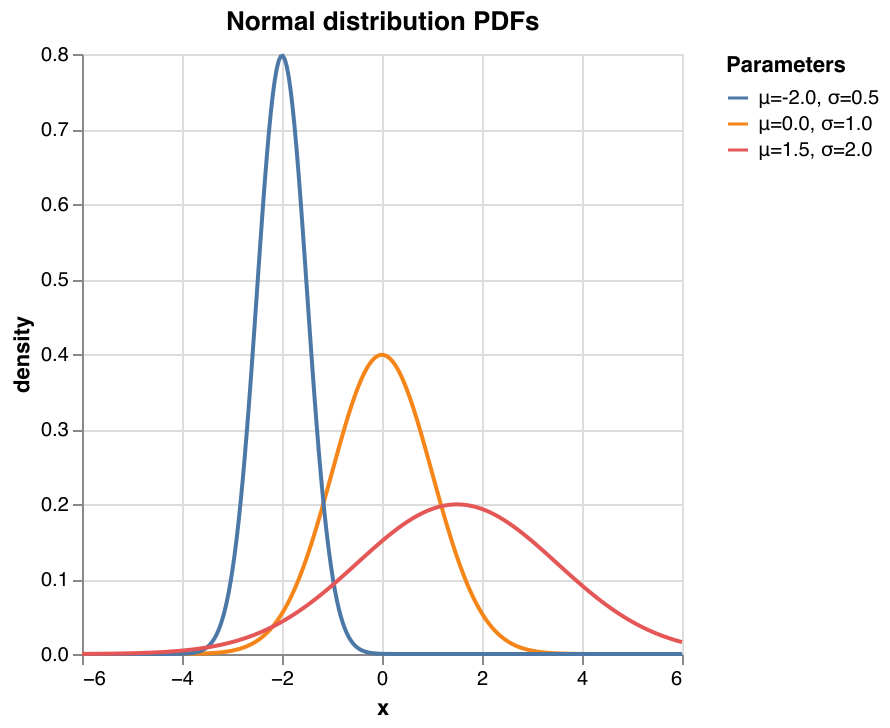
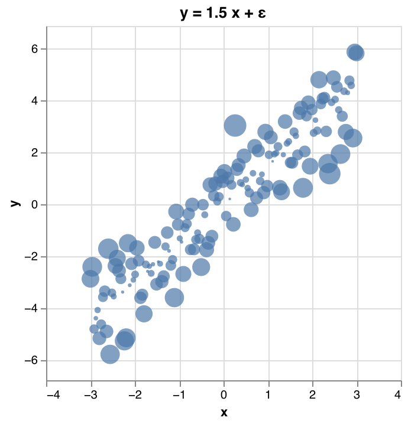
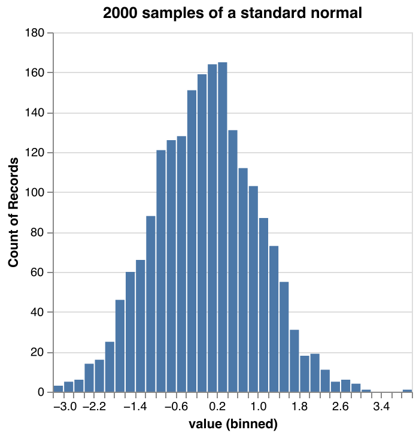
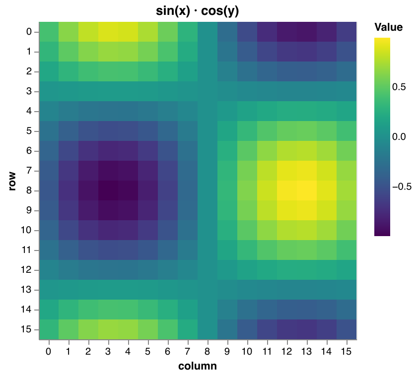
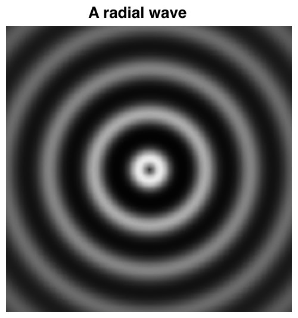
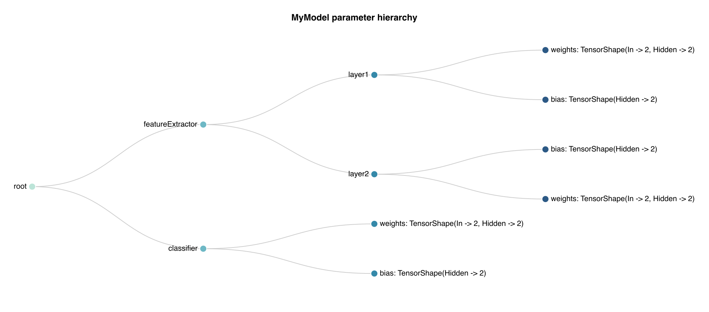
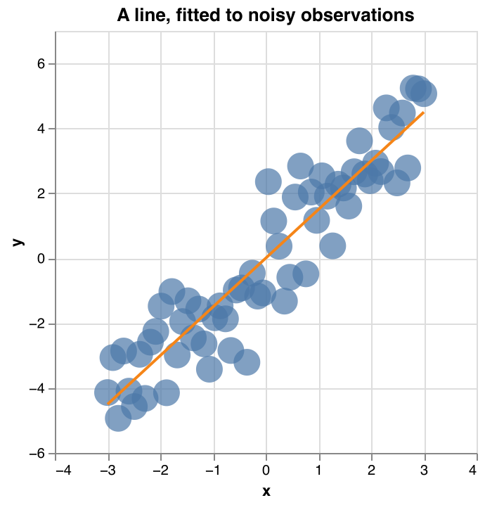
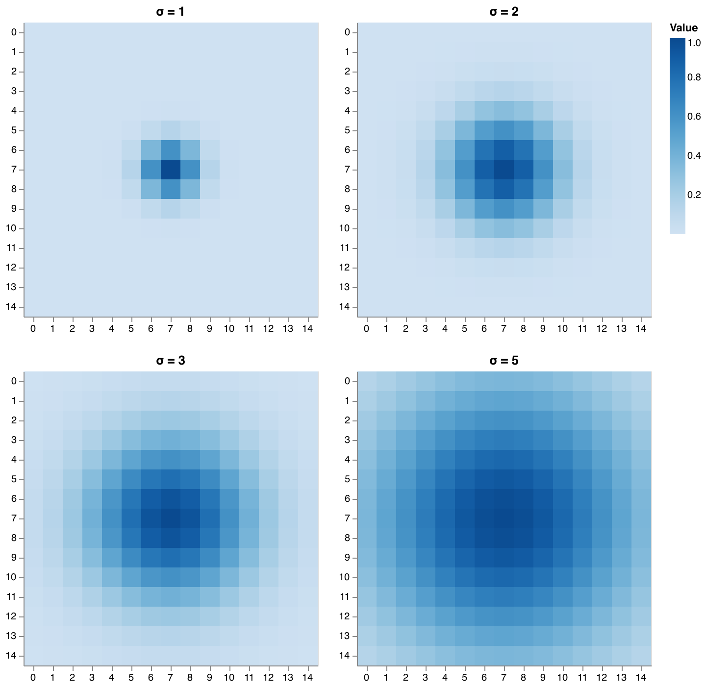
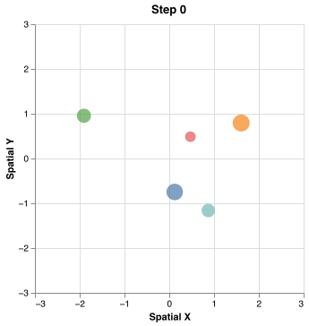

# plotwit - Plots for [DimWit](https://github.com/dimwit-dev/dimwit) tensors

> [!WARNING]
> plotwit is at an early stage of development. It works, but expect a limited
> set of plots, rough edges, and breaking API changes.

plotwit uses [dedav4s](https://github.com/Quafadas/dedav4s), a thin layer over [Vega-Lite](https://vega.github.io/vega-lite/), where a plot is nothing but a Vega(-Lite) JSON. Essentially, plotwit is a set of such Vega-Lite templates with a DimWit tensor API. 
The tensor axes are named, so a plot can say what it expects — `linePlot` wants the `xs` and the `ys` to share an axis, `imagePlot` wants a `Tensor2[Width, Height, UInt8]` — and the compiler checks it for you.

```scala
import dimwit.*
import plotwit.*
import plotwit.PlotTargets.desktopBrowser

dimwit.initialize()

trait X derives Label

val xs = Tensor1(Axis[X]).fromArray(Array.tabulate(100)(i => i / 10.0f))
val ys = xs.sin

display(plots.linePlot(xs, ys, _.title := "sin(x)"))
```

## Getting started

plotwit is not published yet, so build it from source:

```bash
git clone https://github.com/dimwit-dev/plotwit.git
cd plotwit
sbt publishLocal
```

and depend on it:

```scala
resolvers += "Central Portal Snapshots" at "https://central.sonatype.com/repository/maven-snapshots/"
libraryDependencies += "ch.contrafactus" %% "plotwit-core" % "0.1.0-SNAPSHOT"
```

You need what DimWit needs: a JDK and a Python environment with JAX, managed by [uv](https://docs.astral.sh/uv/).

## Plot gallery

One example per plot type. Each of them lives in [examples/src/main/scala/plots](examples/src/main/scala/plots) and is
rendered into [docs/plots](docs/plots) by `sbt renderPlots`, as a PNG next to the Vega JSON it was rendered from.

### Line plot

`linePlot` draws a line through the points `(xs, ys)`. Passing a `Tensor2` of `ys` (plus optional names) draws one line
per index of its first axis, all sharing the same `xs`.



```scala
plots.linePlot(
  xs,
  densities,
  parameters.map((mean, stdDev) => f"μ=$mean%.1f, σ=$stdDev%.1f"),
  _.title := "Normal distribution PDFs",
  _.encoding.x.title := "x",
  _.encoding.y.title := "density",
  _.encoding.color.legend.title := "Parameters"
)
```

[LineExample.scala](examples/src/main/scala/plots/LineExample.scala) — [line.png](docs/plots/line.png), [line.json](docs/plots/line.json)

### Scatter plot

`scatterPlot` places one point per index of the axis shared by `xs` and `ys`. An optional third tensor encodes the size
of the points. All points share one colour.



```scala
plots.scatterPlot(xs, ys, sizes, _.title := "y = 1.5 x + ε", _.encoding.x.title := "x", _.encoding.y.title := "y")
```

Passing a series name per point colours the points by series and adds a legend:

```scala
plots.scatterPlot(xs, ys, sizes, Seq("a", "a", "b"))
```

[ScatterExample.scala](examples/src/main/scala/plots/ScatterExample.scala) — [scatter.png](docs/plots/scatter.png), [scatter.json](docs/plots/scatter.json)

### Histogram

`histogramPlot` bins the values of a `Tensor1` and counts how many of them fall into each bin.



```scala
plots.histogramPlot(samples, _.title := "2000 samples of a standard normal", _.encoding.x.bin.maxbins := 40)
```

[HistogramExample.scala](examples/src/main/scala/plots/HistogramExample.scala) — [histogram.png](docs/plots/histogram.png), [histogram.json](docs/plots/histogram.json)

### Heatmap

`heatmapPlot` draws one cell per element of a `Tensor2`, with the value mapped to a colour. Both axes are ordinal, so it
is meant for small matrices such as grids, kernels or confusion matrices.



```scala
plots.heatmapPlot(
  data,
  _.title := "sin(x) · cos(y)",
  _.encoding.x.title := "column",
  _.encoding.y.title := "row",
  _.encoding.color.scale.scheme := "viridis"
)
```

[HeatmapExample.scala](examples/src/main/scala/plots/HeatmapExample.scala) — [heatmap.png](docs/plots/heatmap.png), [heatmap.json](docs/plots/heatmap.json)

### Image

`imagePlot` embeds a `Tensor2` of `UInt8` intensities as a greyscale image. Useful for anything that is an image
already, such as a sample of a dataset, an activation map or the state of a simulation.



```scala
plots.imagePlot(image, _.title := "A radial wave")
```

[ImageExample.scala](examples/src/main/scala/plots/ImageExample.scala) — [image.png](docs/plots/image.png), [image.json](docs/plots/image.json)

### Tensor tree

`tensorTreeShapePlot` visualises the shape of any `TensorTree`, i.e. of any case class of tensors that derives it. It is
the quickest way to see how the parameters of a model are laid out.



```scala
plots.tensorTreeShapePlot(model, _.title := "MyModel parameter hierarchy", _.width := 900, _.height := 400)
```

[TensorTreeExample.scala](examples/src/main/scala/plots/TensorTreeExample.scala) — [tensor-tree.png](docs/plots/tensor-tree.png), [tensor-tree.json](docs/plots/tensor-tree.json)

## Composing plots

A plot is a value of type `VegaLiteSpec`, and several of them can be combined into one:

| | |
| --- | --- |
| `overlay(a, b, ...)` | layers them on top of each other |
| `hconcat(plots)` / `vconcat(plots)` | puts them next to / below each other |
| `grid(rows)` | arranges them in rows and columns |
| `slider(plots)` | shows one at a time, with a slider to step through them |

`grid` is how the [heat equation example](examples/src/main/scala/HeatEquation.scala) shows 50 states of a diffusing
blob of heat at once, and `slider` is how the [n-body example](examples/src/main/scala/NBodyProblem.scala) scrubs
through 1200 steps of a simulation. The slider is an html input, so it needs a browser — there is nothing of it to show
in a rendered image, which is why the gallery has no example of it.

### Overlay

A fitted line, layered on top of the observations it was fitted to:



```scala
overlay(
  plots.scatterPlot(xs, observations, _.encoding.x.title := "x", _.encoding.y.title := "y"),
  plots.linePlot(
    xs,
    fitted,
    _.title := "A line, fitted to noisy observations",
    _.encoding.x.title := "x",
    _.encoding.y.title := "y",
    _.encoding.color := Json.obj("value" -> Json.fromString("#f58518"))
  )
)
```

[OverlayExample.scala](examples/src/main/scala/plots/OverlayExample.scala) — [overlay.png](docs/plots/overlay.png), [overlay.json](docs/plots/overlay.json)

### Grid

`grid` takes rows of plots; `hconcat` and `vconcat` are the single row and the single column version of it. Here the
four slices of a `Tensor3` of gaussian kernels:



```scala
val heatmaps = kernels
  .unstack(Axis[Kernel])
  .zip(sigmas)
  .map((kernel, sigma) => plots.heatmapPlot(kernel, _.title := f"σ = $sigma%.0f"))

grid(heatmaps.grouped(2).toSeq)
```

[GridExample.scala](examples/src/main/scala/plots/GridExample.scala) — [grid.png](docs/plots/grid.png), [grid.json](docs/plots/grid.json)

## Customising plots

Every plot takes a variable number of *mods* after its data. A mod is a typed path into the underlying Vega-Lite spec,
so `_.encoding.x.title := "time"` sets `encoding.x.title` in the JSON. The paths are derived from the JSON template of
the plot, which means the compiler rejects a field the template does not have:

```scala
plots.scatterPlot(
  xs,
  ys,
  _.title := "Positions",
  _.encoding.x.title := "x",
  _.mark.filled := false,          // compiles: "mark": { "type": "circle", "filled": true }
  _.encoding.x.axis.grid := false  // does not compile: the template has no "axis" under "encoding.x"
)
```

For anything the template does not cover, work with the JSON itself — `toJson(spec)` returns the
[circe](https://circe.github.io/circe/) `Json` of a plot, including its `$schema`.

## Displaying plots

`display(spec)` renders a plot to whatever plot target is in scope:

```scala
import plotwit.PlotTargets.desktopBrowser // opens the plot in your browser
display(spec)
```

`PlotTargets` also has `tempHtmlFile` (writes a self-contained html file), `websocket` (sends the plot to a local
server), `almond` (for Jupyter notebooks), `png` (renders plain Vega specs with `vg2png`), `printlnTarget` and
`doNothing`. Exactly one of them should be imported at a time, since they all are givens of the same type.

There is no target that writes an image of a Vega-Lite plot; the gallery above is rendered by a
[plot target of the examples](examples/src/main/scala/plots/package.scala) that pipes the spec through `vl2png`.

## Development

```bash
sbt test          # run the tests
sbt scalafmtAll   # format
sbt renderPlots   # re-render the plots of the gallery above
```

`sbt renderPlots` writes a PNG and the underlying Vega JSON per gallery plot into `docs/plots`, which needs the
[Vega command line tools](https://vega.github.io/vega/usage/#cli) (`npm install -g vega-cli vega-lite`). A single plot
can be opened in the browser with `sbt "examples/runMain plotwit.examples.plots.showPlot line"`. Re-render and commit
whenever you change a plot or an example, so that the gallery keeps showing what the examples actually generate.

The committed JSON is what a plot compiles to, and comparing it is how to tell whether the gallery is stale — the PNGs
are no good for that, since how they are rendered depends on the fonts of the machine that rendered them.

To add a plot to the gallery, add an example to [examples/src/main/scala/plots](examples/src/main/scala/plots), list it
in [RenderPlots.scala](examples/src/main/scala/plots/RenderPlots.scala) and add a section for it above.

## The n-body problem

Five bodies, pulled around by their mutual gravity, simulated by the
[n-body example](examples/src/main/scala/NBodyProblem.scala) — one `scatterPlot` per step, with the mass of a body as
the size of its point and one series name per body, so that every body keeps its own colour. The example puts 1200 of those steps behind a `slider`.


